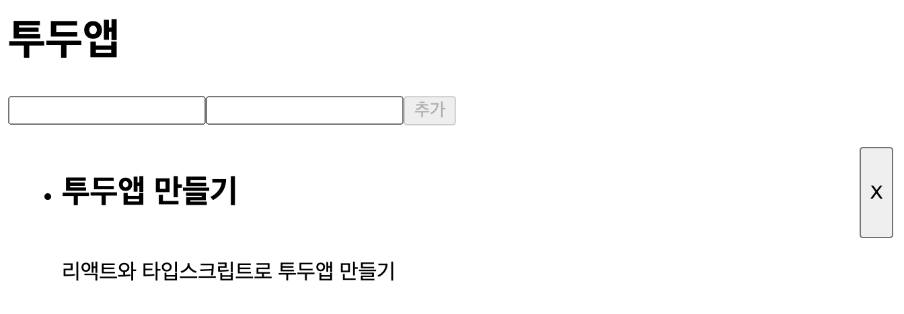

# 투두 - 관심사 분리



```
npm install
```

<br />
<br />

## 기능을 나눈 이유

- **유지보수성의 향상**: 코드를 작은 모듈로 나눔으로, 특정 기능을 수정하거나, 개선해야할시 다른 부분에 영향을 주지 않으며, Controller에서 로직을 변경해도, `TodoForm`과, `Todo` 컴포넌트는 영향을 받지 않는다.
  <br />

- **재사용성 증가**: 특정 기능을 다른 곳에 사용할 수 있으며, 컨트롤러를 사용해 `다른 컴포넌트에서 동일한 상태관리`를 할 수 있으며, **코드중복을 줄이며, 일관성을 유지**한다.
  <br />

- **테스트 용이성**: 각 **모듈을 독립적으로 테스트** 할 수 있으며, Controller는 **Ui와 관련된 부분을 신경쓸 필요가 없으며**, 오직 Js코드이기 때문에 따로 React전용 테스트 라이브러리가 필요하지 않다.

```typescript
// TodoController.ts

- `add(todo: ITodo)`: 새로운 투두 항목을 추가합니다.
- `delete(id: Date)`: 특정 ID를 가진 투두 항목을 삭제합니다.
- `search(keyword: string)`: 제목이나 내용에 키워드가 포함된 투두 항목을 검색합니다.
- `sort(order: SortOrder)`: 투두 항목을 정렬합니다. `order`는 "newest" 또는 "oldest"일 수 있습니다.
- `get()`: 현재 투두 리스트를 반환합니다.
```
